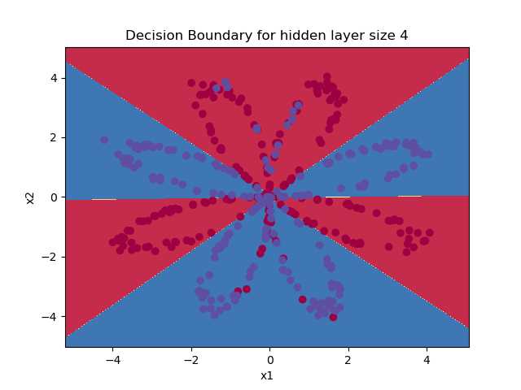

# Planar data classification with one hidden layer

In this repository I build a simple neural network with one hidden layer. The goal is for the neural network to learn a specific pattern of red and blue dots.

 

